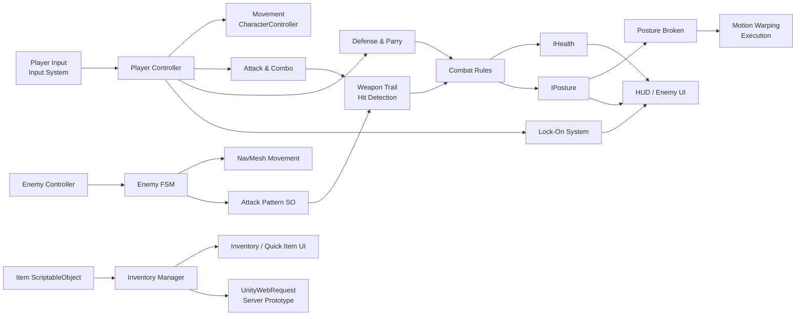
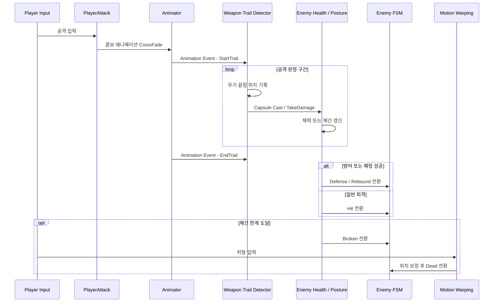
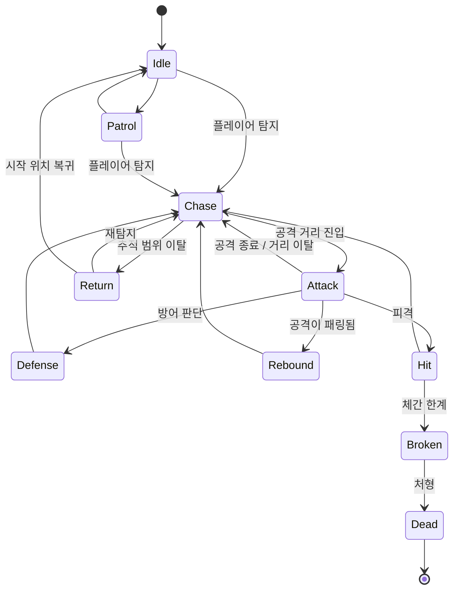
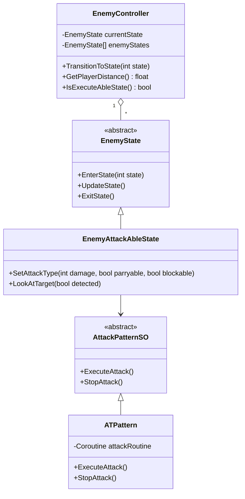
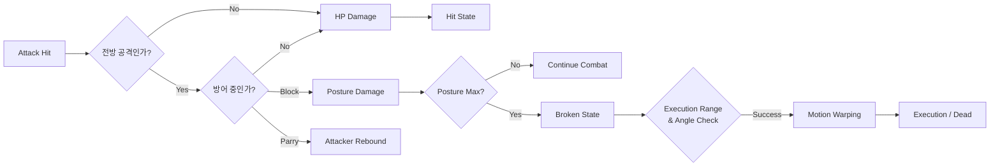
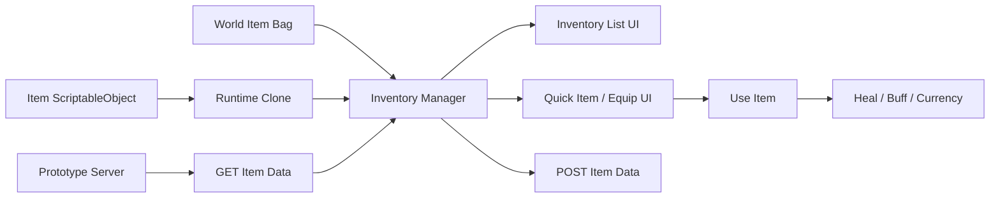

<div align="center">

# Sekiro-Inspired Combat Prototype

### Unity 기반 패링 · 체간 · 락온 · 처형 전투 시스템 포트폴리오

<p>
  
  
  
  
  
  
</p>

<p>
플레이어 조작부터 적 상태 머신, 패링과 체간 붕괴, 무기 궤적 판정,<br/>
Motion Warping 기반 처형까지 구현한 <strong>3D 액션 전투 프로토타입</strong>입니다.
</p>

</div>

---

## 프로젝트 개요

이 저장소는 세키로 스타일의 근접 전투 감각을 Unity에서 구현하며 학습한 내용을 정리한 **클라이언트 프로그래밍 포트폴리오**입니다.

단순 공격과 피격 처리뿐 아니라 다음 전투 흐름을 하나의 시스템으로 연결하는 데 중점을 두었습니다.

> **탐지 → 추적 → 공격 → 방어/패링 → 체간 누적 → 체간 붕괴 → 처형**

공개 저장소에는 직접 작성한 C# 코드만 포함합니다.  
모델, 애니메이션, 이펙트, 사운드, 씬, 프리팹 및 라이선스가 있는 외부 에셋은 포함하지 않습니다.

따라서 이 저장소는 **완전한 실행 프로젝트가 아니라 코드 구조와 구현 방식을 검토하기 위한 기술 포트폴리오**입니다.

---

## 핵심 구현

| 영역 | 구현 내용 |
|---|---|
| 플레이어 제어 | Input System 기반 이동 입력, CharacterController 이동, 점프, 웅크리기 |
| 근접 전투 | 최대 4연속 공격, Animation Event 기반 공격 판정 구간 |
| 무기 판정 | 무기 끝점의 이동 궤적을 기록하고 Capsule Cast로 빠른 공격의 누락 보완 |
| 방어와 패링 | 공격 방향, 방어 가능 여부, 패링 가능 여부를 반영한 전투 분기 |
| 체력과 체간 | `IHealth`, `IPosture` 인터페이스를 통한 플레이어·적 공통 규약 |
| 적 AI | Idle, Patrol, Chase, Return, Attack, Defense, Hit, Rebound, Broken, Dead 상태 |
| 공격 패턴 | ScriptableObject 기반 연속 공격 데이터와 패턴 실행 |
| 락온 | Cinemachine 카메라 전환, 거리 기반 자동 해제, 대상 UI 추적 |
| 처형 | 체간 붕괴 상태와 Motion Warping을 결합한 위치·방향 보정 |
| 발 IK | 지형 Raycast 결과를 이용한 양발 위치와 골반 높이 보정 |
| 아이템 | ScriptableObject 아이템, 습득, 인벤토리 UI, 장착형 퀵 아이템 |
| 서버 연동 실험 | UnityWebRequest 기반 인벤토리 GET/POST 프로토타입 |

---

## 전체 시스템 구조



---

## 전투 처리 흐름



### 판정 설계

공격 판정은 단일 프레임의 Trigger 충돌에만 의존하지 않습니다.

1. 애니메이션 이벤트가 공격 판정 시작을 알립니다.
2. 판정 구간 동안 무기 끝점 위치를 연속으로 기록합니다.
3. 이전 위치와 현재 위치 사이를 여러 구간으로 나눕니다.
4. 각 구간에서 Capsule Cast를 수행합니다.
5. 한 공격에서 이미 피격된 Collider는 `HashSet`으로 중복 타격을 차단합니다.
6. 대상의 `IHealth` 구현을 통해 데미지와 방어 방향을 전달합니다.

이를 통해 낮은 프레임이나 빠른 검격에서 발생할 수 있는 **터널링과 타격 누락을 줄이는 방식**을 실험했습니다.

---

## 적 AI 상태 머신

일반 검객은 탐색과 전투, 체간 붕괴와 처형까지 이어지는 상태를 독립 컴포넌트로 분리했습니다.



### 상태 구성 방식



각 상태는 `EnterState`, `UpdateState`, `ExitState` 수명주기를 가지며, 이동·공격·방어·피격 로직을 상태별 컴포넌트로 분리했습니다.

---

## 플레이어 시스템

### 입력과 이동

`PlayerInputComponent`가 Input Action 콜백에서 이동, 점프, 웅크리기, 방어, 인벤토리 입력을 수집합니다.

`PlayerMovement`는 다음 책임을 담당합니다.

- 카메라 방향 기준 이동 벡터 계산
- CharacterController 이동
- 지면 검사와 중력
- 락온 여부에 따른 회전 방식 변경
- 이동 상태의 Animator 전달

### 공격과 콤보

`PlayerAttack`은 짧은 입력을 유효 공격으로 판정하고 최대 4회의 콤보 단계를 관리합니다.

- 콤보 입력 최소 간격
- 콤보 유지 제한 시간
- Animator CrossFade
- 공격 중 이동 및 애니메이션 상태 제어
- Animation Event 기반 무기 판정 활성화

### 방어와 패링

`PlayerDefense`는 플레이어 전방의 공격 대상을 검사하고 다음 결과를 구분합니다.

- 일반 방어
- 패링 성공
- 방어 불가능 공격
- 공격자의 리바운드 상태 전환
- 체간 데미지 전달
- 패링 이펙트 이벤트

### 락온

`PlayerLockOnSystem`은 주변 대상을 탐색하여 가장 가까운 적을 선택하고 Cinemachine 카메라의 Follow/LookAt 대상을 전환합니다.

- 대상 거리 검사
- 락온 위치용 별도 Transform
- 화면 중앙 보정용 Mid Point
- 대상 파괴 또는 거리 이탈 시 해제
- 락온 UI 이벤트 연동

---

## 체력 · 체간 · 처형



`IHealth`와 `IPosture`를 통해 플레이어와 적의 공통 전투 계약을 정의했습니다.

체간이 한계에 도달하면 적은 `Broken` 상태로 전환되고, 처형 가능 거리와 각도를 만족할 때 Motion Warping을 실행합니다. 처형 애니메이션 시작 시 CharacterController 충돌을 일시적으로 비활성화하고, 종료 후 위치와 회전을 복구합니다.

---

## 데이터 기반 공격 패턴

공격 패턴은 ScriptableObject로 분리했습니다.

```text
AttackPattern_SO
├─ 공격 이름
├─ 단계별 데미지
├─ 단계별 애니메이션
├─ 단계별 재생 시간
├─ 패링 가능 여부
└─ 방어 가능 여부
```

`AT_Pattern`은 패턴 데이터를 순서대로 실행하며 각 공격 단계마다 다음 정보를 적 공격 상태에 전달합니다.

```csharp
attackState.SetAttackType(
    damages[index],
    isReboundableAttack[index],
    isDefenseableAttack[index]
);
```

방어 불가능 공격은 별도의 위험 알림 이벤트를 발행하여 UI 연출과 연결합니다.

---

## 아이템과 인벤토리



### 구현 내용

- ScriptableObject 기반 아이템 원형 데이터
- 런타임 아이템 복제
- 아이템 ID와 수량 기반 인벤토리
- 필드 아이템 습득
- 인벤토리 셀 동적 생성 및 재사용
- 소비 아이템 사용
- 장착형 퀵 아이템 순환
- UnityWebRequest 기반 서버 저장·불러오기 실험

서버 연동 부분은 클라이언트-서버 통신 구조를 학습하기 위한 프로토타입입니다.

---

## 발 IK

`IkFootPlacement`는 양발 본 위치에서 지면으로 Raycast를 수행해 경사면에서도 발이 지면을 따라가도록 보정합니다.

- 발 위치 Raycast
- 지면 Normal 기반 발 회전
- 양발 높이를 기준으로 골반 위치 보정
- Lerp를 통한 부드러운 IK 이동
- Animator IK Pass 연동

---

## 코드 구조

아래 구조는 공개 저장소에서 권장하는 배치 기준입니다.

```text
Sekiro-Portfolio/
├─ Assets/
│  └─ Scripts/
│     ├─ Ai/
│     │  └─ Enemy/
│     │     ├─ AttackStrategy/
│     │     ├─ Normal_Katana/
│     │     └─ Last_Boss/
│     ├─ Data/
│     │  └─ SO_Script/
│     ├─ Interface/
│     ├─ Manager/
│     ├─ MotionWarp/
│     ├─ Object/
│     ├─ Player/
│     ├─ SMB/
│     ├─ UI/
│     ├─ Utill/
│     └─ IkFootPlacement.cs
├─ Docs/
│  └─ architecture/
├─ README.md
└─ THIRD_PARTY_NOTICES.md
```

### 폴더별 역할

| 경로 | 역할 |
|---|---|
| `Ai/Enemy` | 적 공통 컨트롤러, 상태 기반 클래스, 탐지와 공격 데이터 |
| `Ai/Enemy/Normal_Katana` | 일반 검객 FSM과 체력·체간·처형 상태 |
| `Ai/Enemy/Last_Boss` | 보스 전투 상태와 패링·방어 반응 |
| `Player` | 입력, 이동, 공격, 방어, 체력, 락온, 이펙트 |
| `Interface` | 체력, 체간, 탐지, 공격 전략의 공통 계약 |
| `Data/SO_Script` | 아이템과 스킬 ScriptableObject 정의 |
| `Manager` | 인벤토리 상태와 서버 동기화 |
| `MotionWarp` | 처형 상호작용과 Motion Warping 연동 코드 |
| `SMB` | Animator StateMachineBehaviour 보조 로직 |
| `UI` | 체력·체간·락온·인벤토리 UI |
| `Object` | 필드 아이템 상호작용 |
| `Utill` | 공용 수치 변환 유틸리티 |

---

## 주요 코드 진입점

| 시스템 | 코드 |
|---|---|
| 플레이어 입력 | [`PlayerInputComponent.cs`](Assets/Scripts/Player/PlayerInputComponent.cs) |
| 이동 | [`PlayerMovement.cs`](Assets/Scripts/Player/PlayerMovement.cs) |
| 공격과 무기 판정 | [`PlayerAttack.cs`](Assets/Scripts/Player/PlayerAttack.cs) |
| 방어와 패링 | [`PlayerDefense.cs`](Assets/Scripts/Player/PlayerDefense.cs) |
| 체력과 체간 | [`PlayerHealth.cs`](Assets/Scripts/Player/PlayerHealth.cs) |
| 락온 | [`PlayerLockOnSystem.cs`](Assets/Scripts/Player/PlayerLockOnSystem.cs) |
| 적 FSM 기반 | [`EnemyController.cs`](Assets/Scripts/Ai/Enemy/EnemyController.cs) |
| 적 상태 기반 | [`EnemyState.cs`](Assets/Scripts/Ai/Enemy/EnemyState.cs) |
| 일반 검객 | [`Normal_Katana`](Assets/Scripts/Ai/Enemy/Normal_Katana) |
| 보스 | [`Last_Boss`](Assets/Scripts/Ai/Enemy/Last_Boss) |
| 공격 패턴 | [`AttackStrategy`](Assets/Scripts/Ai/Enemy/AttackStrategy) |
| 처형 연동 | [`PlayerExcution.cs`](Assets/Scripts/MotionWarp/PlayerExcution.cs) |
| 인벤토리 | [`InventoryManger.cs`](Assets/Scripts/Manager/InventoryManger.cs) |
| 발 IK | [`IkFootPlacement.cs`](Assets/Scripts/IkFootPlacement.cs) |

---

## 기술 스택과 외부 의존성

| 기술 | 사용 목적 |
|---|---|
| Unity / C# | 게임 클라이언트와 전투 시스템 구현 |
| Unity Input System | Action 기반 플레이어 입력 |
| CharacterController | 플레이어 이동과 충돌 |
| NavMeshAgent | 적 추적, 순찰, 복귀 |
| Cinemachine | 락온 카메라 |
| Animator / StateMachineBehaviour | 공격, 이동, 피격 상태와 이벤트 |
| ScriptableObject | 아이템 및 공격 패턴 데이터 |
| UnityWebRequest | 인벤토리 서버 통신 실험 |
| Kinemation Motion Warping | 처형 위치·회전 정렬 |

> 외부 라이브러리의 소스와 라이선스 에셋은 이 저장소에 포함하지 않습니다.  
> 저장소에 연동 코드만 공개할 경우 `THIRD_PARTY_NOTICES.md`에 사용 라이브러리와 라이선스를 별도로 기록해야 합니다.

---

## 설계상 중점

### 1. 애니메이션과 판정의 동기화

공격 판정 시작과 종료를 Animation Event로 제어하여 시각적인 검격과 실제 충돌 구간을 일치시키도록 구성했습니다.

### 2. 상태별 책임 분리

적의 행동을 하나의 거대한 `Update` 조건문으로 작성하지 않고, 상태별 컴포넌트로 분리했습니다. 각 상태는 진입·갱신·종료 수명주기를 가집니다.

### 3. 공통 전투 인터페이스

플레이어와 적이 서로 다른 구현을 가지면서도 `IHealth`, `IPosture`를 통해 동일한 공격 시스템과 연결되도록 구성했습니다.

### 4. 데이터와 실행 로직 분리

공격 정보는 ScriptableObject로 관리하고, 상태 컴포넌트가 해당 데이터를 실행하도록 구성해 공격 패턴 추가 비용을 줄였습니다.

### 5. 디버깅 가능성

공격 궤적, 탐지 범위, 처형 각도와 거리 등을 Gizmo로 확인할 수 있도록 구현했습니다.

---

## 공개 저장소 범위

### 포함

- 직접 작성한 C# 스크립트
- 시스템 구조를 설명하는 README와 Mermaid 문서
- 라이선스상 공개 가능한 코드
- 필요한 경우 직접 촬영한 GIF 또는 스크린샷

### 제외

- 모델, 애니메이션, 텍스처, 머티리얼
- 사운드와 이펙트 원본
- 유료 또는 재배포 불가 에셋
- 씬과 프리팹
- 외부 라이브러리 원본 코드
- 서버의 비공개 구현과 인증 정보

---

## 현재 범위와 한계

- 본 저장소는 전투 시스템 학습용 프로토타입의 소스 코드 아카이브입니다.
- 에셋과 씬이 제외되어 저장소만으로 플레이할 수 없습니다.
- 인벤토리 서버 통신은 로컬 개발 환경을 전제로 한 실험 코드입니다.
- 보스 시스템은 핵심 전투 상태를 중심으로 구현된 프로토타입입니다.
- 공개 전 코드 인코딩, 명명, 외부 패키지 의존성을 정리하는 과정이 필요합니다.

---

## 개선 방향

- 공격 판정을 공통 `WeaponSweepHitDetector`로 추출
- Physics Cast를 NonAlloc API 기반으로 최적화
- enum 인덱스 의존 FSM을 타입 기반 상태 등록 구조로 개선
- ScriptableObject 공격 데이터와 적별 런타임 상태 분리
- 입력을 Input System 단일 경로로 통합
- 인벤토리와 서버 Repository 계층 분리
- Assembly Definition과 테스트 코드 추가

---

## 참고

이 프로젝트는 특정 상용 게임의 코드나 리소스를 복제한 프로젝트가 아닙니다.  
해당 게임의 전투 메커니즘에서 영감을 받아 Unity에서 직접 구조를 설계하고 구현한 학습 및 포트폴리오 프로젝트입니다.
